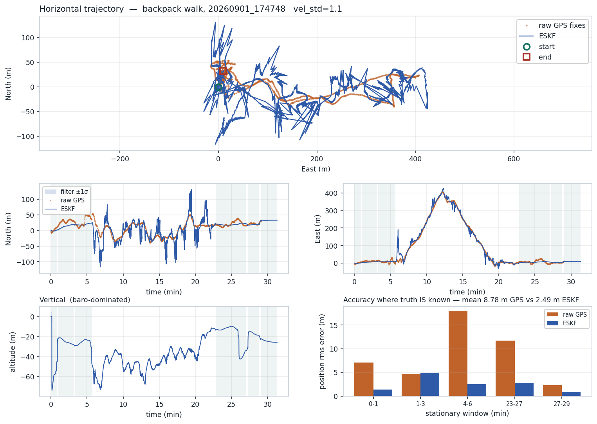
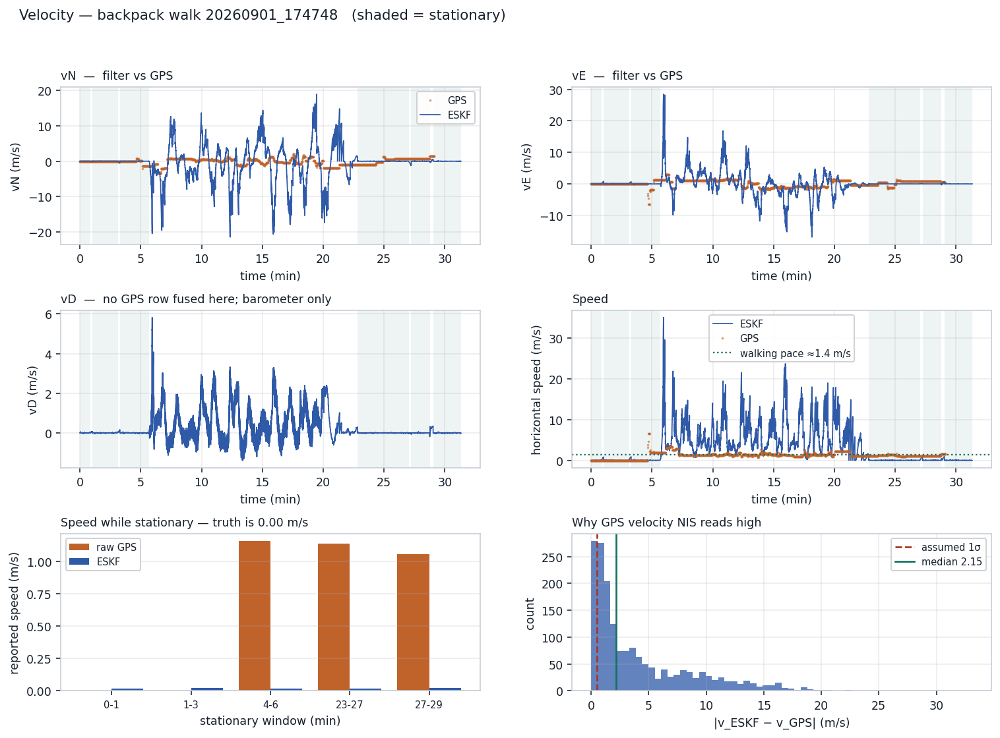
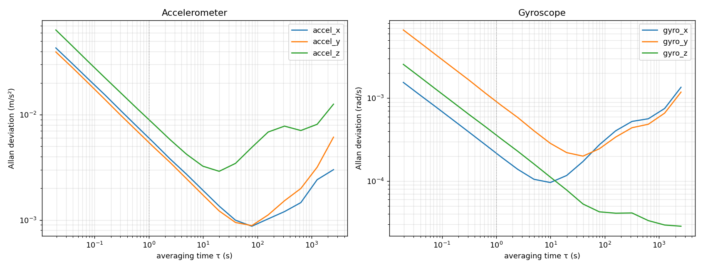

# Drone Navigation Filter

A 15-state error-state Kalman filter fusing IMU, GNSS, barometer and
magnetometer, running on a Raspberry Pi 4.

**The finished system is more accurate than the GNSS receiver it fuses.**
Measured over intervals where the true position is independently known —
periods when the vehicle was demonstrably stationary, so the true position
is a constant and any scatter is real error:

| | raw GNSS | this filter |
|---|---|---|
| Position RMS | 8.86 m | **3.19 m** |
| Velocity (truth = 0) | 1.1 m/s | **0.017 m/s** |

Innovation consistency on open-sky data: **position NIS 2.86 against a
theoretical 3.0**.



The velocity result is the starker one — a GNSS receiver sitting motionless
on the ground still reports over a metre per second of movement, while the
filter reports 17 mm/s:



---

## Hardware

| | part | interface |
|---|---|---|
| IMU | MPU6050 | I²C `0x68` |
| GNSS | NEO-6M | UART, NMEA |
| Barometer | BMP180 | I²C `0x77` |
| Magnetometer | LIS2MDL | I²C `0x1E` |

Measured loop rate **51.65 Hz** — not the nominal 100. This matters: Allan
variance results scale with the assumed rate, so assuming the nominal
figure would have skewed every noise parameter below.

## Layout

```
src/           the filter itself -- no I/O, so the identical file runs
               on the Pi and in offline replay
pi/            the live driver and its hardware layer
calibration/   run once on the assembled hardware
tools/         offline analysis: replay, Allan variance, sensor isolation
data/          one recorded run
docs/          full work log and figures
```

## Running it

The directory split here is organisational. **On the Pi everything sits in
one directory** — `pi_live_nav_eskf.py` imports `eskf` and `geodetic` as
flat modules, so deployment means copying them alongside:

```bash
scp pi/*.py src/*.py  pi@raspberrypi:~/nav/
ssh pi@raspberrypi 'cd ~/nav && python3 pi_live_nav_eskf.py'
```

Needs `numpy`, `mpu6050`, `pynmea2`, `pyserial`.

Keep the unit **flat and still for the first few seconds** — that is the
static alignment window, and the gyro-bias seed it produces is what makes
the zero-velocity detector work at all. Watch for `seeded: bg = [-6.1x, ...]`
with the Y and Z components near zero.

Two calibration files (`accel_calibration.json`, `lis2mdl_calibration.json`)
are produced by the scripts in `calibration/` and loaded at startup. Without
them the driver warns and continues, but gravity reads 6.26% low and heading
carries the full hard-iron error.

## Every parameter is measured, not assumed

| parameter | value | how it was obtained |
|---|---|---|
| `sig_accel` | 6.8272e-03 | Allan variance, 2.2 h stationary log |
| `sig_gyro` | 4.9586e-04 | Allan variance |
| `sig_ba_rw` | 3.9666e-04 | Allan variance |
| `sig_bg_rw` | 5.1150e-05 | Allan variance — `gyro_z` excluded, its fit was untrustworthy (slope −0.02 where +0.50 is required) |
| accel bias & scale | `accel_calibration.json` | six-position test |
| magnetometer hard iron | −25 µT on Y | min/max tumble |
| `GPS_VEL_STD` | 1.10 m/s | measured at rest, then swept against a real walk |
| gyro bias | ~−6.1 °/s | re-seeded at every startup |



The gyro bias-drift parameter had been **understated by a factor of 36**
before it was measured — the filter was far too confident that its gyro
offset held still, while the same log shows it genuinely drifting 0.21 °/s
over 2.7 hours.

## Some things that were found the hard way

Each of these is a real failure, diagnosed against recorded data. The full
account is in [`docs/WORK_LOG.md`](docs/WORK_LOG.md).

**A bootstrap deadlock.** The zero-velocity detector tests bias-corrected
gyro rate against a threshold. With the bias estimate starting at zero and
the hardware sitting at 6.1 °/s, it read eleven times over threshold —
permanently. So the detector never fired, the bias was never observed, and
the threshold never dropped. Broken by measuring the bias directly before
the filter starts.

**One gate deciding for two measurements.** GNSS position and velocity
shared a single acceptance test, so a diverged velocity estimate discarded
perfectly good position fixes. Splitting them costs nothing mathematically —
`R` is already diagonal — and moved position NIS from 39.72 to 7.74.

**An observability problem.** At rest, a slight mounting tilt and an
accelerometer bias produce *identical* readings, so the filter's estimate
drifted between them with no visible symptom — velocity stayed at 0.01 m/s
throughout. The accumulated error was released the moment the vehicle
moved. Resolved by injecting the six-position calibration result, which
*can* separate them.

**A hardware fault, not a software one.** Intermittent barometer corruption
(4.7% of reads, 97 hPa noise against a 0.03 hPa datasheet figure) turned out
to be a marginal I²C connection. Three software theories were pursued first.
The tell was in the data throughout: the *good* readings were always
perfect, which is a connection dropping out rather than a sensor degrading.

## Reproducing

```bash
cd tools
cp ../data/*.csv .

# filter health on the reference run -- NIS, acceptance rates
python replay.py 20260901_174748
```

The 2.7-hour stationary log that produced the noise parameters is 56 MB and
is not committed here. `tools/allan.py` is the analysis that consumed it:

```bash
python allan.py <imu_log>.csv --rate 51.654 --lead-cols 2 --plot allan.png
```

`--rate` must be measured from the timestamps rather than assumed, and
`--lead-cols 2` because the log format is `(t, dt, ax, ...)`.

## Known limitations

- **GPS-denied flight costs 0.87 m per second of outage.** Zero-velocity
  updates cannot help while moving — they only apply when genuinely
  stationary. This is the MPU6050's bias instability, not a tuning problem;
  it needs another aiding source.
- **The magnetometer disturbance check tests field *magnitude* only.** A
  disturbance that rotates the field without changing its strength passes
  straight through. A 2.7-hour run took a permanent 36° heading shift that
  way.
- **The barometer is the sole observer of the vertical channel.** GNSS
  vertical velocity is correctly dropped, since NMEA RMC does not measure it
  and fusing its fabricated zero removes 96% of a real climb rate.
- **51.65 Hz is fine for flight dynamics** but is why violently
  hand-carried motion breaks the mechanisation — at 199 °/s, attitude
  changes 3.9° between samples.
